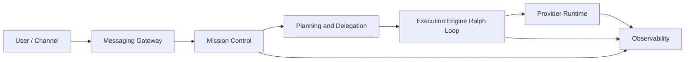

# feat: Unified Personal Agent Platform Contract-First Foundation

## Overview

이 계획은 `nanoclaw + orchestrator + ralph-loop + codex2message`를 독립 모듈 기반으로 통합하기 위한 **Contract-First 플랫폼 기반 설계/검증 계획**이다.

핵심 목표는 다음 3가지다.
- 독립 모듈 캡슐화(경계 침범 방지)
- 계약 안정성(상태/이벤트/위임/결과 의미론 단일화)
- NanoClaw식 미니멀리즘 유지(OpenClaw식 비대화 억제)

## Enhancement Summary (Deepened: 2026-02-27)

- 강화 범위: 실행계획 핵심 섹션 다수(성공기준/계약전략/테스트/시뮬레이션/게이트/단계/기술선정/리스크/결정기록/다음액션)
- 적용 관점: `architecture-strategist`, `spec-flow-analyzer`, `security-sentinel`, `performance-oracle`, `code-simplicity-reviewer`, `framework-docs-researcher`, `best-practices-researcher`, `learnings-researcher`
- 핵심 개선:
  1. Gate D 검증 선행조건(경계 lint baseline) 명시로 단계 모순 제거
  2. Gate 증빙 산출물의 경로/소유/포맷 계약 추가
  3. 메시징 버스 기본선 확정(NATS JetStream)으로 Open Questions-Working Defaults 충돌 제거
  4. 공식 문서 기반 운영 리스크 반영(NATS dedupe, OTel trace context, JSON Schema 확장 속성, LangFuse SDK/인시던트)

## Brainstorm Inputs

Found brainstorm from `2026-02-27`: `unified-personal-agent-platform`. Planning context로 사용.

### Primary inputs
- `../10-discovery/2026-02-27-uap-core.brainstorm.md`
- `../20-architecture/2026-02-27-uap-contract-boundaries.architecture.md`
- `../20-architecture/2026-02-27-uap-contract-first-requirements.architecture.md`
- `../10-discovery/2026-02-27-uap-failure-simulation.simulation.md`
- `../10-discovery/2026-02-27-uap-approach-options.strategy.md`
- `../40-quality/2026-02-27-uap-issue-closure-matrix.quality.md`

### Review findings consolidation
- 이슈 `001~007`은 개별 TODO 파일이 아니라 아래 문서에서 통합 추적한다.
- `../40-quality/2026-02-27-uap-issue-closure-matrix.quality.md`
- 본 문서의 `Success Criteria`, `Gap-driven action list`, `Gate Plan` 섹션에 반영되어 있다.

### Learnings corpus check
- `docs/solutions/`는 현재 미구성 상태다.
- 따라서 이번 심화는 내부 계획 문서 + 공식 문서 기반으로 수행했고, 구현 이후 발생 이슈는 `docs/solutions/`에 누적해 다음 deepen cycle 입력으로 사용한다.

## Section Manifest (Deepen Scope)

- Section 1: `Problem Statement` + `Success Criteria` - 목적/완료기준의 검증 가능성 강화
- Section 2: `Interface & Contract Design Plan` - 계약 진화 규칙과 하위 호환성 통제 강화
- Section 3: `Methodology Plan` + `SpecFlow Analysis` - 테스트·시뮬레이션의 누락 경로 축소
- Section 4: `Gate Plan` + `Gate Exit Evidence` - 게이트 판정 기준의 실행가능성 강화
- Section 5: `Implementation Plan` - Phase 간 선후 의존성 충돌 해소
- Section 6: `Technology Plan` + `External best-practice checks` - 공식 문서 기반 의사결정 고정
- Section 7: `Risks`, `Working Defaults`, `Next Action` - 운영 리스크와 의사결정 잔여 모호성 제거

## Problem Statement

우리가 풀 문제는 "에이전트를 하나 더 만든다"가 아니다.

정확한 문제는:
- 실행 엔진(ralph-loop), 조정자(orchestrator), 계획/위임(nanoclaw core), 채널 어댑터(codex2message 계열), provider adapter를
- **서로 직접 결합하지 않고 계약으로만 연결**해,
- provider/agent 교체에도 동일 run 의미를 유지하는 **개인 에이전트 플랫폼**을 만드는 것이다.

## Success Criteria

- [ ] P1 계약 이슈(상태 vocabulary/idempotency/evidence)가 문서와 테스트 기준에서 해소됨
- [ ] P2 강건성 이슈(cancel/o11y delivery/policy ownership/auth scope)가 계약에 반영됨
- [ ] Gate A~G를 모두 통과하지 않으면 구현 단계로 전진하지 않음
- [ ] 모듈 간 직접 내부 import 없이 계약 패키지만 경유
- [ ] `codex/claude/local-llm` 최소 2개 provider 교차 시 run 의미론 동일
- [ ] `uap-docs.sh sync`가 통과하고 frontmatter catalog가 최신 상태로 유지됨

### Quantitative readiness thresholds
- [ ] cancel 요청 후 `cancel_ack_at` 기록 p95 <= 5s, p99 <= 10s
- [ ] 동일 `idempotency_key` 중복 트리거 시 중복 실행률 < 0.1%
- [ ] Gate C fault injection에서 trace chain 단절률 = 0
- [ ] `complete` 판정 중 `evidence_quality!=strong` 허용률 = 0
- [ ] provider cross-check Mission A/B/C에서 상태 매핑 불일치 0건

### Measurement contract (for gate verdict reproducibility)
- 측정 단위: latency는 ms 정수, timestamp는 UTC ISO-8601로 기록
- 측정 윈도우: 동일 `git_commit` 기준 단일 campaign snapshot(Provider Cross-Check + Fault Injection)으로 판정
- 최소 샘플: Mission A/B/C 각 provider pair당 30 run 이상, fault-injection 각 시나리오 10 run 이상
- 데이터 소스: Gate B는 C1(cancel timestamps), Gate C는 C5(trace/event fields), Gate F는 idempotency/dedupe logs
- 집계 규칙: p95/p99는 raw 샘플 기반으로 계산(평균치로 대체 금지)
- 샘플 부족/로그 누락 시 verdict는 `inconclusive`로 기록하고 Phase 6 기준에서는 fail로 취급

### Provider Cross-Check Mission Set (for Success Criteria)
- Mission A: 단일 task 완료 + strong evidence 산출
- Mission B: subtask handoff 포함 체인 실행
- Mission C: cancel 중간 개입 + terminal 상태 수렴

## Scope

### In scope (Phase 1)
- Contract-first 기준선 수립
- DDD Lite 경계/용어/정책 정의 고정
- 패키지 경계 규칙 + boundary lint 정책 수립
- 상태/위임/결과/관측/보안 계약 고정
- 시뮬레이션-게이트 기반 검증 계획 확정

### Out of scope (Phase 1)
- 재시작 복구(checkpoint/resume)
- 고급 UI/ops 콘솔
- 고도 자동 튜닝
- 대규모 멀티에이전트 병렬 최적화

## Priority Charter

### Non-negotiable (절대 우선)
1. 계약 일관성
2. 실행 무결성(idempotency/budget/depth/cancel)
3. 완료 검증성(strong evidence)
4. 보안 경계(auth_scope/secret_ref/redaction)
5. 관측 연속성(trace 체인 보존)

### Negotiable (초기 타협 가능)
- 체크포인트 복구
- 고급 UX 자동화
- 고급 비용 최적화

## Chosen Approach

`Alpha core + Beta feedback + Gamma provider hardening` 혼합 경로.

- Alpha: 계약/정책/경계 우선 고정
- Beta: 조기 E2E smoke로 현실성 검증
- Gamma: provider 편차를 중간 단계에서 병렬 제어

## Domain Architecture Plan (DDD Lite)

## Bounded Contexts
- Mission Control
- Execution Engine (`ralph-loop`)
- Planning & Delegation (`nanoclaw core`)
- Provider Runtime
- Messaging Gateway (`codex2message` lineage)
- Observability

## Context responsibilities
- Mission Control: run lifecycle source-of-truth + policy authority
- Execution Engine: loop execution + completion evidence production
- Planning: objective decomposition + handoff generation
- Provider Runtime: model/tool invocation abstraction
- Messaging Gateway: inbound/outbound relay + ack
- Observability: run/task/span/event trace continuity

## Context map (high-level)



## Architecture Plan by Module

## Package topology (hybrid physical split)

### Repo A: `monday` (main agent repo)
- `packages/agent-kernel`
- `packages/executor-ralph-loop`
- `packages/orchestrator`
- `packages/contract-bindings`
- `packages/provider-client-adapter`
- `packages/o11y-client-adapter`
- `packages/messaging-adapter`
- `apps/control-plane` (thin optional)

### Repo B: `platform-provider-gateway` (independent)
- `services/provider-runtime`
- `adapters/provider-codex`
- `adapters/provider-claude`
- `adapters/provider-local-llm`

### Repo C: `platform-observability-gateway` (independent)
- `services/telemetry-gateway`
- `sinks/langfuse-sink`
- `buffer/replay-worker`

### Repo D: `platform-contracts` (independent)
- `schemas/run-lifecycle.schema.json`
- `schemas/subtask-handoff.schema.json`
- `schemas/executor-result.schema.json`
- `schemas/provider-invocation.schema.json`
- `schemas/observability-event.schema.json`
- `compat/compatibility-report.md`

## Boundary rules
- [ ] 공용 계약 타입은 `platform-contracts` 배포 패키지 경유 import만 허용
- [ ] 로컬 DTO/event는 소유 레포 외부 공개 금지
- [ ] orchestrator는 executor 내부 로직/상태 세부를 해석하지 않음
- [ ] provider 구현체 직접 참조 금지, `ProviderPort` 경유
- [ ] messaging은 상태 생성자가 아니라 relay/ack 전용

## Candidate class/service contracts

### `/packages/orchestrator/src/mission_orchestrator.ts`
- `createRun(mission: MissionInput): RunRef`
- `applyPolicy(runId: string): PolicyDecision`
- `transition(runId: string, event: RunEvent): RunStatus`

### `/packages/executor-ralph-loop/src/ralph_loop_executor.ts`
- `execute(context: RunContext, handoff?: SubtaskHandoff): ExecutorResult`
- `cancel(runId: string, reason: string): CancelAck`

### `/packages/agent-kernel/src/subtask_delegator.ts`
- `plan(mission: MissionInput): TaskPlan`
- `delegate(handoff: SubtaskHandoff): SubtaskRunRef`

### `/packages/provider-client-adapter/src/provider_client.ts`
- `invoke(request: ProviderInvokeRequest): ProviderInvokeResult`

### `/packages/o11y-client-adapter/src/timeline_emitter_client.ts`
- `emit(event: TraceEventEnvelope): EmitResult`

## Interface & Contract Design Plan

## Canonical enums
- `RunStatus = queued | running | blocked | terminal`
- `TerminalOutcome = succeeded | failed | canceled`
- `ResultType = complete | partial | failed | canceled`
- `EventDelivery = pending | delivered | retriable_failed | terminal_failed`

## Mapping rules
- `complete -> terminal(succeeded)`
- `failed -> terminal(failed)`
- `canceled -> terminal(canceled)`
- `partial -> running|blocked + resume/blocked hints`

## Core contracts to finalize

### C1 Run Lifecycle
필수:
- `run_id, mission_id, status, timestamp, source_module, contract_version`
- `terminal_outcome, reason_code`
- `idempotency_key, dedupe_window_ms`
- `cancel_requested_at, cancel_ack_at, cancel_effective_at, cancel_reason`

### C2 Subtask Handoff
필수:
- `parent_run_id, subtask_id, objective, constraints, budget, timeout, expected_artifact, return_contract_version`
- `idempotency_key, dedupe_window_ms, policy_version`

### C3 Executor Result
필수:
- `run_id, result_type, evidence, metrics, policy_consumption`

evidence 최소 구조:
- `artifact_ref, artifact_hash, verification_method, verifier, verified_at, evidence_quality`
- rule: `complete`는 `evidence_quality=strong`만 허용

### C4 Provider Invocation
필수:
- `provider_id, model_id, input_ref, tool_policy, cost_budget, latency_budget`
- `auth_scope, allowed_tool_scope, secret_ref, data_classification`

### C5 Observability Event
필수:
- `trace_id, span_id, parent_span_id, run_id, event_type, event_time, attributes`
- `event_id, sequence_no, delivery_status, delivery_attempt`

## Compatibility/version strategy
- `major`: breaking
- `minor`: optional field add
- `patch`: non-semantic fix
- unknown optional fields는 무시, required는 엄격 검증

### JSON Schema compatibility guardrails
- `additionalProperties`의 기본값은 허용(true)이므로, C1~C5 스키마는 객체 단위로 허용/차단 정책을 명시한다.
- required 필드 제거/이름 변경은 `major`만 허용한다.
- optional 필드 추가(`minor`) 시 consumer contract test를 반드시 동반한다.
- enum 신규 값 추가 시 구버전 consumer의 fallback 동작(무시/차단)을 계약 테스트에서 명시 검증한다.

## Error taxonomy baseline
- `CONTRACT_VALIDATION_ERROR`
- `POLICY_VIOLATION`
- `PROVIDER_UNAVAILABLE`
- `EXECUTION_TIMEOUT`
- `CANCELLED_BY_USER`
- `OBSERVABILITY_BACKEND_DOWN`
- `IDEMPOTENCY_CONFLICT`
- `EVIDENCE_VERIFICATION_FAILED`
- `INSUFFICIENT_AUTH_SCOPE`

## Methodology Plan

## DDD Lite
- 경계/언어/정책 먼저 고정
- 컨텍스트 책임 충돌 금지
- policy authority는 Mission Control로 단일화

## TDD strategy
1. Contract tests
2. Policy tests
3. Integration tests
4. E2E timeline tests
5. Fault injection tests

### Gate-linked test matrix
- Gate A: schema validation + backward compatibility + enum mapping regression
- Gate B: cancel race, timeout, budget/depth ceiling, policy authority 단일성
- Gate C: o11y backend down/slow에서 event replay, ordering, dedupe
- Gate D: boundary lint(import graph), secret boundary(policy + static scan)
- Gate E: evidence verifier 위조/누락/약한증거 시나리오
- Gate F: scheduler storm + duplicate webhook 재생
- Gate G: frontmatter/link/catalog validator 회귀

## ADR discipline
- 계약 경계 변경은 짧은 ADR 필수
- ADR 없이 enum/required field 변경 금지

## NanoClaw Anti-Bloat Discipline
- 새 기능 전: prompt/policy/contract로 해결 가능한지 먼저 확인
- 계약 변경 없는 대규모 추상화 추가 금지
- extension 분리 원칙 유지(core loop 보호)

## SpecFlow Analysis (Flow Completeness)

## User flow overview
1. 사용자 명령 수신 -> run 생성
2. plan 생성 -> subtask handoff
3. executor loop 수행 -> provider 호출
4. evidence 생성 -> result 반환
5. lifecycle terminal 전이 -> 메시지/관측 반영

## Permutations matrix
| Dimension | Cases |
|---|---|
| User context | first-time / returning / canceled mid-run |
| Trigger | scheduler / manual command / webhook |
| Provider | codex / claude / local-llm |
| Network | 정상 / 지연 / 부분 실패 |
| Observability backend | 정상 / ingest 지연 / 다운 |
| Run type | single-task / subtask chain |

## Critical gaps identified
- 상태 vocabulary drift
- idempotency 표준 필드 누락
- evidence 검증 스키마 미정
- cancel ack timeline 미정
- observability delivery semantics 미정
- policy authority 모호
- provider auth scope 계약 누락

## Simulation Plan (Expanded Thought Experiments)

기준 시나리오: S01~S20 (브레인스토밍 문서 기준)

### Category A: Contract correctness
- status split-brain
- schema evolution mismatch
- subtask handoff field loss

### Category B: Control and safety
- cancel race
- policy ownership conflict
- budget overflow + retry storm

### Category C: Reliability and delivery
- scheduler storm
- o11y replay storm
- provider partial outage

### Category D: Security
- provider auth escalation
- secret leak via logs
- oversized tool scope

### Category E: Minimalism drift
- boundary erosion by direct imports
- utility explosion without contract value

### Category F: Version and ecosystem drift
- LangFuse SDK major upgrade(v3 -> v4) 시 adapter 호환성 붕괴
- OTel semconv/log correlation 필드 변경으로 trace-link 손실
- schema producer/consumer 버전 어긋남으로 event 해석 실패

## Rebuttal loop protocol
- 주장 수집 -> 반박 -> 재반박 -> 채택 규칙 기록
- unresolved면 구현 금지 상태 유지

## Gate Plan (Must-pass before progression)
- Gate A 계약: lifecycle/handoff/result/o11y contract validation
- Gate B 제어: cancel/budget/depth behavior verification
- Gate C 관측: run-to-span continuity and replay safety
- Gate D 경계: boundary lint, no direct cross-module coupling
- Gate E 증거: strong evidence enforcement
- Gate F 중복: idempotency/dedupe regression
- Gate G 문서운영: frontmatter/catalog/link automation validation

## Gate Exit Evidence (Required Artifacts)

게이트 통과는 \"의견\"이 아니라 아래 증빙 산출물로 판정한다.

- Gate A: `platform-contracts/compat/compatibility-report.md`, 계약 스키마 검증 로그, enum/mapping 검증 결과
- Gate B: `control-policy-test-report.md`, cancel latency 측정 결과, budget/depth 위반 테스트 결과
- Gate C: `observability-replay-report.md`, trace continuity 점검 결과, 이벤트 재전송/중복 제거 결과
- Gate D: `boundary-lint-report.md`, cross-module import 위반 0건 증빙, scope/security regression 결과
- Gate E: `evidence-validation-report.md`, `complete -> strong evidence` 강제 검증 결과
- Gate F: `idempotency-regression-report.md`, duplicate trigger 재생 테스트 및 dedupe 수렴 결과
- Gate G: `docs-automation-report.md`, `uap-docs.sh sync` 실행 로그, catalog 최신화(diff) 확인 결과

### Evidence location and ownership contract
- 공통 저장 루트: `<docs-root>/40-quality/evidence/<gate>/<YYYY-MM-DD>/`
- Gate A/F 산출물 소유: `platform-contracts` + `orchestrator` 오너
- Gate B/E 산출물 소유: `executor-ralph-loop` + `agent-kernel` 오너
- Gate C 산출물 소유: `platform-observability-gateway` + `o11y-client-adapter` 오너
- Gate D 산출물 소유: `monday` 아키텍처 오너
- Gate G 산출물 소유: docs governance 오너
- 산출 포맷: 요약은 Markdown, 이벤트/측정 raw는 NDJSON 또는 CSV를 함께 첨부
- Phase 6 진입 조건: 모든 게이트 산출물이 동일 날짜 스냅샷으로 존재해야 함

### Gate naming and evidence manifest contract
- gate 디렉토리 slug: `gate-a-contract`, `gate-b-control`, `gate-c-observability`, `gate-d-boundary`, `gate-e-evidence`, `gate-f-idempotency`, `gate-g-docops`
- 각 gate snapshot 필수 파일:
  - `summary.md` (판정 근거 요약)
  - `manifest.json` (메타/샘플/판정)
  - `raw/` (NDJSON/CSV 원본)
  - `checksums.txt` (raw 무결성 해시)
- `manifest.json` 필수 키:
  - `gate_id`, `generated_at_utc`, `git_commit`, `owner`, `sample_size`, `measurement_window`, `verdict`, `source_reports`
- `verdict` 허용 값: `pass | fail | inconclusive`
- `inconclusive`는 품질 결함이 아니라 증빙 결함으로 분류하지만 Phase 6 진입 기준에서는 `fail`과 동일 처리

## Implementation Plan (Hierarchical)

### Phase 0 - Planning Freeze
- [ ] canonical enums and schema source freeze
- [ ] resolved decisions snapshot 고정(외부 상태/스키마 소스/계약 소유)
- [ ] issue-closure-matrix updated
- [ ] 문서 운영 자동화 baseline 고정 (`uap-docs.sh` check/catalog/sync)

Deliverables:
- `<docs-root>/20-architecture/2026-02-27-uap-contract-boundaries.architecture.md` 최종화
- `<docs-root>/20-repos/monday/40-quality/2026-02-27-uap-issue-closure-matrix.quality.md` 업데이트
- `<docs-root>/90-navigation/2026-02-27-uap-document-map.navigation.md` 읽기 순서/관계 반영
- `<docs-root>/20-repos/monday/30-execution-plan/2026-02-27-uap-contract-first-foundation.execution-plan.md`
- `<docs-root>/2026-02-27-uap-frontmatter-catalog.navigation.md` 최신화

### Phase 0.5 - Documentation Operations Hardening
- [ ] `doc_type↔postfix`, `domain↔directory`, `status`, `related_docs`, Markdown link 검증 규칙 유지
- [ ] `README`/`document-map`/`catalog` 간 링크 정합성 유지
- [ ] `._*`(AppleDouble) 정리 자동화 유지

Must verify:
- [ ] Gate G

### Phase 1 - Contract Baseline (P1 closure)
- [ ] C1/C2/C3 required fields final
- [ ] status mapping final
- [ ] evidence schema final
- [ ] idempotency/dedupe rule final

Must verify:
- [ ] Gate A
- [ ] Gate E
- [ ] Gate F

### Phase 2 - Policy and Control Hardening (P2 part)
- [ ] cancel timeline semantics final
- [ ] policy authority final
- [ ] error taxonomy alignment
- [ ] boundary lint rule v1 정의(import/path + provider secret boundary + ownership rule)

Must verify:
- [ ] Gate B

### Phase 3 - Observability Hardening (P2 part)
- [ ] event_id/sequence/delivery semantics final
- [ ] replay/backoff behavior criteria
- [ ] trace/log correlation field standard

Must verify:
- [ ] Gate C

### Phase 4 - Security Boundary Hardening (P2 part)
- [ ] provider auth scope + secret_ref semantics final
- [ ] redaction policy contract finalize
- [ ] allowed_tool_scope baseline
- [ ] `monday`에서 provider raw secret 직접 접근 금지(반드시 `platform-provider-gateway` 경유)

Must verify:
- [ ] Gate D

### Phase 5 - Architecture Conformance and Pruning
- [ ] boundary lint rules 확장/예외 정제(v1 기반)
- [ ] module responsibility checklist 작성
- [ ] bloated artifact pruning 기준 적용

Must verify:
- [ ] direct import violations = 0
- [ ] no unowned utility modules

### Phase 6 - Pre-Implementation Readiness Review
- [ ] A~G gate pass evidence assembled
- [ ] unresolved critical questions = 0
- [ ] implementation kickoff decision

## Technology Plan (Provisional)

- Runtime: TypeScript/Node.js (orchestrator/kernel/provider)
- Executor isolation: TS first, Rust optional split later
- Contract schema: JSON Schema first-source + SemVer
- Messaging bus: NATS JetStream(default), Redis Streams(ADR 승인 시 대체)
- Observability: OpenTelemetry conventions + LangFuse sink

## External best-practice checks (applied)
- NATS JetStream dedupe(`Nats-Msg-Id`) + duplicate window 모델을 기준선으로 채택
- NATS exactly-once pub/sub 조건(dedup + double-ack)을 참고해 Gate F 검증항목 강화
- OpenTelemetry logging trace context(`trace_id`, `span_id`, `trace_flags`)를 C5 필수 correlation 필드로 고정
- JSON Schema 기본 확장 허용 동작(`additionalProperties`)을 반영해 계약 drift 방지 가드레일 추가
- LangFuse SDK(v3 -> v4) 마이그레이션 리스크 및 ingestion delay 인시던트 사례를 반영해 replay/fallback 우선순위 상향

### Version watchlist (quarterly)
- OTel semconv/logging spec 버전 업데이트 추적
- LangFuse SDK major 변경 추적(JS/Python)
- NATS JetStream duplicate/ack semantics 변경 추적
- 변경 감지 시 영향도 ADR 작성 후 Gate A/C/F 회귀 검증

## Risks and Mitigations

### Technical risks
- Contract overdesign -> 최소 필드/버전 전략으로 완화
- Provider variance -> provider regression matrix로 완화
- Boundary erosion -> lint + CI guardrail
- Documentation drift -> `uap-docs.sh sync` + catalog 자동 갱신으로 완화

### Operational risks
- O11y backend outage -> local fallback + replay semantics
- Cost runaway -> per-run/per-day budget policy
- Duplicate triggers -> idempotency key + dedupe window
- Third-party SDK/version drift -> adapter version pin + quarterly watchlist

## Quality Gates and Acceptance Criteria

### Functional
- [ ] run lifecycle semantics fully deterministic
- [ ] subtask handoff lossless transfer
- [ ] explicit completion only with strong evidence

### Non-functional
- [ ] security scope contractized
- [ ] observability continuity preserved under failure
- [ ] boundary rule violations block merge
- [ ] Gate evidence snapshot reproducible within 1 command set
- [ ] 모든 gate snapshot에 `manifest.json`이 존재하고 `inconclusive` verdict가 없음

### Documentation completeness
- [ ] all contract fields have rationale
- [ ] every gate has measurable check
- [ ] issue closure matrix fully mapped
- [ ] frontmatter/catalog automation validation green

## References & Research

### Internal references
- `../10-discovery/2026-02-27-uap-core.brainstorm.md`
- `../20-architecture/2026-02-27-uap-contract-boundaries.architecture.md`
- `../20-architecture/2026-02-27-uap-contract-first-requirements.architecture.md`
- `../10-discovery/2026-02-27-uap-failure-simulation.simulation.md`
- `../40-quality/2026-02-27-uap-issue-closure-matrix.quality.md`
- `../00-governance/2026-02-27-uap-doc-governance.meta.md`
- `../00-governance/scripts/uap-docs.sh`
- `../2026-02-27-uap-frontmatter-catalog.navigation.md`

### External references
- https://docs.nats.io/nats-concepts/jetstream/headers
- https://docs.nats.io/using-nats/developer/develop_jetstream/model_deep_dive
- https://docs.nats.io/using-nats/developer/develop_jetstream/model_deep_dive#exactly-once-semantics
- https://opentelemetry.io/docs/specs/semconv/general/trace/
- https://opentelemetry.io/docs/specs/otel/compatibility/logging_trace_context/
- https://json-schema.org/understanding-json-schema/reference/object
- https://langfuse.com/docs/sdk/typescript/migration-guide-v4
- https://status.langfuse.com/

## Open Questions (Need Final Decision Before Work)
- 없음(Phase 0 핵심 의사결정 확정 완료)

## Resolved Decisions
- 외부 상태 모델: Option C 변형 (핵심 `queued|running|blocked|terminal` + `terminal_outcome` 상세 분리)
- 계약 스키마 single source: Option A (JSON Schema first)
- 계약 소유 모델: Option C (하이브리드, 공용 C1~C5는 `platform-contracts`, 내부 DTO/event는 각 레포 로컬 소유)
- 메시징 버스 기본선: NATS JetStream(대체안 Redis Streams는 ADR 승인 시에만 허용)

## Recommendation
- 계약 소유 모델: Option C (경계 일관성과 팀 자율성 균형)

## Working Defaults (Until Explicitly Changed)

현재 합의된 기본값은 아래와 같다.

- External state model: Option C variant (`queued|running|blocked|terminal` + `terminal_outcome`)
- Contract schema source: Option A (JSON Schema first)
- Contract ownership model: Option C (shared C1~C5 in `platform-contracts`, local internal contracts per repo)
- Messaging bus: NATS JetStream(default), Redis Streams는 명시적 ADR 승인 시 대체

위 기본값이 변경되면 Phase 0에서 ADR을 갱신하고 Gate A 회귀 검증을 재수행한다.

## MVP File Sketch (Pseudo)

```text
../platform-contracts/schemas/run-lifecycle.schema.json
../platform-contracts/schemas/subtask-handoff.schema.json
../platform-contracts/schemas/executor-result.schema.json
../platform-contracts/schemas/provider-invocation.schema.json
../platform-contracts/schemas/observability-event.schema.json
packages/orchestrator/src/mission_orchestrator.ts
packages/executor-ralph-loop/src/ralph_loop_executor.ts
packages/agent-kernel/src/subtask_delegator.ts
packages/contract-bindings/src/index.ts
packages/provider-client-adapter/src/provider_client.ts
packages/o11y-client-adapter/src/timeline_emitter_client.ts
../platform-provider-gateway/services/provider-runtime/src/provider_gateway.ts
../platform-observability-gateway/services/telemetry-gateway/src/timeline_emitter.ts
```

## Next Action

- 이 계획 승인 후 `/prompts:workflows-work` 이전에,
  - Phase 0 체크리스트(결정 스냅샷/문서 동기화) 완료 여부 확인
  - 측정 계약(윈도우/샘플수/집계 규칙) 확정본을 Gate B/C/F 오너와 서면 합의
  - Gate evidence 저장 루트 구조(`40-quality/evidence/<gate>/<YYYY-MM-DD>`) 생성 및 오너 매핑 확인
  - gate slug 규칙 및 `manifest.json` 필수 키 템플릿 확정
  - Gate G(`uap-docs.sh sync`) 통과 로그 첨부
  - P1 closure 조건을 체크리스트로 승인
