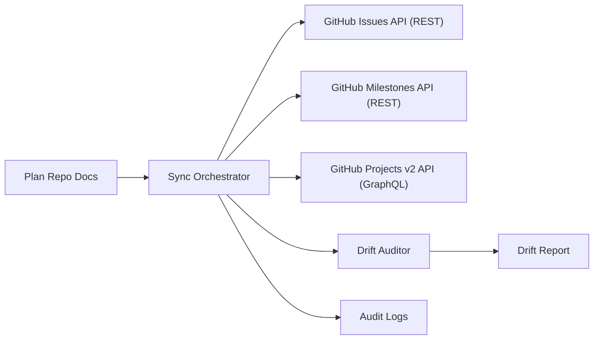

# feat: UAP GitHub PlanningOps Sync Foundation

## Enhancement Summary (Deepened: 2026-02-27)
- 강화 범위: 성공기준, 계약 설계, 운영 runbook, 실패 시뮬레이션, 단계별 검증 게이트
- 적용 관점: architecture, spec-flow, security, performance, operability, simplicity
- 핵심 개선:
  - KPI를 측정 계약으로 고정해 gate verdict 재현성을 확보
  - 내부 상세 상태와 외부 공개 상태를 분리해 캡슐화 유지
  - 남은 의사결정은 기본값 + 재검토 트리거 방식으로 운영해 진행 정체 방지
  - 실행 명령/산출물 경로를 명시해 운영자 편차 축소

## Overview
이 계획은 계획 전용 레포(`uap-plans`)를 기준 소스로 삼아, 문서 변경(commit/push)을 GitHub 실행 단위(Issues, Milestones, Projects v2)로 자동 동기화하는 PlanningOps 기반을 정의한다.

핵심 목표:
- 계획 문서와 실행 추적의 단절 제거
- 다중 레포 작업을 initiative 중심으로 통합 추적
- 수작업 상태 변경을 계약 기반 자동화로 대체

## Single Plan Repo Operating Contract
단일 계획 레포를 독립 운영할 때의 최소 계약을 먼저 고정한다.

### Repository role split
- `uap-plans`:
  - 계획/게이트/상태의 canonical source
  - GitHub 동기화 워크플로의 trigger source
  - 실행 산출물(artifact summary, drift report)의 보관소
- 실행 레포들:
  - 실제 코드 변경과 릴리즈 실행 단위
  - 계획 동기화 결과(issue/milestone/project item)의 대상

### Branch and trigger rule
- plan 변경은 기본 브랜치 merge 기준으로만 sync한다.
- `workflow_dispatch`는 워크플로 파일이 default branch에 있을 때만 수신되므로 운영 기준 브랜치를 명확히 고정한다.
- nightly schedule은 고부하 시간대 지연 가능성을 감안해 `HH:00` 인접 시각을 피해서 설정한다.

### Plan directory contract (portable)
- 레포 루트 기준 상대경로만 사용:
  - `docs/initiatives/<initiative>/10-brainstorm/*.md`
  - `docs/initiatives/<initiative>/20-architecture/*.md`
  - `docs/initiatives/<initiative>/30-execution-plan/*.md`
  - `docs/initiatives/<initiative>/40-quality/*.md`
- 외부 이동/복제 대비를 위해 절대경로 금지, 루트 상대경로 강제.

### Canonical write policy
- 사람이 수정하는 authoritative surface는 `uap-plans` 문서와 승인된 override label만 허용한다.
- Project UI 직접 수정은 read/observe 대상으로 취급하며, 정책 위반 변경은 drift로 승격한다.

## Brainstorm Inputs
Found brainstorm from `2026-02-27`: `uap-github-planningops-sync`. Planning context로 사용.

### Primary inputs
- `../10-brainstorm/2026-02-27-uap-github-planningops-sync.brainstorm.md`
- `../20-repos/monday/10-discovery/2026-02-27-uap-core.brainstorm.md`
- `./2026-02-27-uap-contract-first-foundation.execution-plan.md`

### Local research summary
- 현재 UAP 문서는 initiative 계층(`00/10/20/30/40/90`)과 frontmatter governance를 기반으로 운영 중.
- `uap-docs.sh`로 frontmatter/link/catalog 검증 자동화가 이미 존재.
- `docs/solutions/`는 아직 없음(기관 학습 데이터 미축적 상태).

## Research Decision
외부 API 연동(Projects v2, Issues, Milestones, Actions) 및 권한 모델이 포함되므로 external research를 수행했다.

### External research highlights (official docs)
- Projects는 built-in automations, API, Actions를 함께 제공한다.
- built-in auto-add는 필터 기반 자동 추가가 가능하지만 기존 아이템은 소급 추가되지 않는다.
- Projects v2 자동화는 GraphQL(`addProjectV2ItemById`, `updateProjectV2ItemFieldValue`) 중심이다.
- Projects classic 관련 mutation은 deprecated 표기가 있으므로 Projects v2 전용 경로로 고정해야 한다.
- Issue/Milestone 생성은 REST API가 단순하고 권한 모델이 명확하다.
- Actions 트리거(`workflow_dispatch`)와 API dispatch 권한 요건을 충족해야 한다.

## Problem Statement
계획은 문서에 있고 실행 추적은 GitHub에 있어, 상태 동기화가 수동이면 누락과 드리프트가 필연적으로 발생한다.  
문서-트래커 간 계약과 자동 동기화 엔진이 없다면 다중 레포 initiative 관리의 신뢰성이 낮아진다.

## Section Manifest (Deepen Scope)
- Section 1: Success Criteria - 계량 지표/측정 방식/증빙 경로를 함께 고정
- Section 2: Interface Contracts - 상태, 매핑, idempotency, drift, override 경계 강화
- Section 3: Sync Strategy - trigger/reconcile/failure handling의 실행 가능성 강화
- Section 4: Implementation Plan - Phase별 산출물과 gate 증빙 연결 강화
- Section 5: Operations - runbook 명령, 아카이브 경로, 재시도/롤백 기준 명시

## Goals
- Plan Repo를 단일 진실원천(Source of Truth)으로 고정
- 문서 항목을 GitHub Issue/Milestone/Project Item으로 idempotent하게 동기화
- Gate/상태 변경을 Project field로 일관되게 반영
- 수동 변경으로 인한 드리프트를 감지하고 리포트

## Non-Goals (Phase 1)
- 완전 양방향 쓰기 동기화
- GitHub Project UI를 진실원천으로 승격
- 예측 분석(velocity/ETA) 자동화
- 조직 전체 포트폴리오 BI 대시보드

## Success Criteria
- [ ] plan item -> issue/project item 생성 중복률 0%
- [ ] 동일 입력 재실행 시 결과 불변(idempotent convergence)
- [ ] 대상 레포 N개(최소 2개)에서 동일 계약으로 동작
- [ ] status/gate 업데이트가 5분 내 GitHub Project field에 반영
- [ ] nightly drift report가 생성되고 unresolved drift가 24시간 내 해소
- [ ] 수동 오버라이드는 정책상 허용된 레이블/필드에서만 허용

### Quantitative KPI Contract
| KPI | Target | Source |
|---|---|---|
| Duplicate creation rate | `0%` | sync summary artifact |
| Idempotent convergence pass rate | `100%` | idempotency replay test |
| Status/Gate propagation p95 | `<= 300s` | workflow timeline + project field update timestamps |
| High-severity drift unresolved age | `<= 24h` | nightly drift report |
| Illegal manual change auto-detect rate | `100%` | drift auditor classification logs |

### Measurement and Evidence Rules
- 측정 윈도우: 동일 `git_commit` 기준 push-trigger run + nightly reconcile run을 1세트로 평가
- 최소 샘플: pilot repo 2개에서 각 20개 이상 plan item 동기화
- 기록 포맷: UTC ISO-8601 timestamp + numeric latency(seconds)
- 산출물 위치:
  - `planningops/artifacts/sync-summary/<run_id>.json`
  - `planningops/artifacts/drift-report/<date>.md`
  - `planningops/artifacts/kpi/<date>.json`
- 로그 누락/샘플 부족 시 verdict는 `inconclusive`, gate는 fail로 취급

## Scope

### In scope (Phase 1)
- plan 문서 파서 + desired state 생성기
- GitHub Issue/Milestone/Project v2 동기화 엔진
- one-way sync + drift detect/report
- GitHub App 기반 권한 모델
- push + manual dispatch + scheduled reconcile

### Out of scope (Phase 1)
- bidirectional auto-merge conflict resolution
- human conversation 요약/생성형 이슈 작성 자동화
- GitHub 외 트래커(Linear/Jira) 동시 지원

## Integration Topologies (Decision Matrix)
| Topology | 설명 | 장점 | 단점 | Phase 1 채택 |
|---|---|---|---|---|
| A. Plan push -> API sync -> Project | 문서 변경 시 즉시 apply | 가장 단순, SoT 보존 | API 실패 시 즉시 영향 | Yes |
| B. Webhook-driven reactive reconcile | `projects_v2_item` 이벤트 기반 재정합 | polling 감소, drift 반응 빠름 | projects webhook preview 리스크 | Partial (observe-only) |
| C. Scheduled-only batch sync | 주기 배치만 실행 | 운영 예측 용이 | 반영 지연 큼 | No |
| D. Dual-write docs+Project | 문서/Project 모두 쓰기 소스 | 사용 편의성 | 충돌 해석 복잡 | No |

선정 이유:
- Phase 1은 A를 기본, B는 관측 전용(알림/드리프트 감지)으로 제한한다.
- C/D는 단순성/캡슐화 원칙을 약화시키므로 후순위.

## Chosen Approach
`Plan-Repo Source of Truth + One-Way Sync + Scheduled Reconciliation`을 채택한다.

- Plan Repo: 계약/상태의 기준 데이터 소스
- Sync Engine: desired vs actual diff 계산 후 적용
- GitHub: 실행 상태의 반영 대상(역방향은 감지/경고 전용)

## Priority Charter
### Non-negotiable
1. 계약 기반 idempotent 수렴
2. 문서 SoT 유지(one-way write)
3. drift 탐지/보고의 신뢰성
4. 최소권한 보안 경계
5. 운영 재현성(runbook + artifact trace)

### Negotiable (Phase 1 타협 가능)
- 프로젝트 field 세부 taxonomy 고도화
- milestone 세분화 규칙 고도화
- 고급 대시보드 시각화

## Domain Architecture Plan (DDD Lite)

## Bounded Contexts
- Plan Source (문서/스키마/frontmatter)
- Sync Orchestrator (파싱/매핑/적용)
- GitHub Adapter (REST + GraphQL)
- Drift Auditor (검증/리포트)
- Observability & Audit (실행 로그/결과 아카이브)

## Context responsibilities
- Plan Source: initiative/plan item/gate의 canonical 정의
- Sync Orchestrator: desired-state 계산 + apply 순서 제어
- GitHub Adapter: 이슈/마일스톤/프로젝트 필드 API 호출
- Drift Auditor: GitHub 실제 상태와 문서 상태 불일치 탐지
- Observability & Audit: 실행 이력, 실패 원인, 재시도 증빙 보존

## Context map (high-level)


## Interface & Contract Design Plan

## C1 Plan Item Contract
필수:
- `initiative_id`, `plan_doc_id`, `plan_item_id`, `title`, `description`
- `owner`, `priority`, `target_repo`, `status`, `gate_refs`
- `sync_policy`, `version`, `updated_at`

## C2 GitHub Mapping Contract
필수:
- `plan_item_id -> issue_number`
- `initiative_id + target_repo -> milestone_number`
- `issue_node_id -> project_item_id`
- `project_field_ids` (status/gate/owner/date)

불변성:
- 동일 `plan_item_id`는 동일 레포에서 단일 issue로 수렴
- mapping은 append/update만 허용, 임의 재할당 금지

## C3 Status Contract
Plan item lifecycle:
- Internal: `draft | active | blocked | done`
- GitHub Issue state: `open | closed`
- Project Status field: `Todo | In Progress | Blocked | Done` (project 설정명 기준)
- Gate verdict: `pass | fail | inconclusive`

매핑 규칙:
- `done` -> issue `closed` + project status `Done`
- `blocked` -> issue `open` + project status `Blocked`
- `active` -> issue `open` + project status `In Progress`
- `draft` -> issue `open` + project status `Todo`
- `done` 판정은 `gate pass`를 선행 조건으로 사용한다. issue가 먼저 closed 되어도 gate evidence가 없으면 drift/audit 대상이다.

## C4 Sync Idempotency Contract
- `sync_key = <plan_doc_id>:<plan_item_id>:<version>:<target_repo>`
- 같은 `sync_key` 재실행은 create가 아닌 no-op/update로 수렴
- apply 단계는 `milestone -> issue -> project item -> field update` 고정 순서

## C5 Drift Contract
- Drift 유형: `MISSING_ENTITY | FIELD_MISMATCH | ILLEGAL_MANUAL_CHANGE | ORPHAN_ITEM`
- `drift_severity = low | medium | high`
- high drift는 다음 sync에서 자동 보정, 실패 시 manual approval queue로 이동

## C6 Public Status Projection Contract (Encapsulation)
내부 sync 단계는 상세하게 유지하되 외부 소비자에는 최소 상태만 공개한다.

- Internal run states (sync execution lifecycle):
  - `queued | collecting | diffing | applying | reconciling | completed | failed`
- External projected states:
  - `running | terminal`
- External terminal reason:
  - `succeeded | failed | canceled | inconclusive`

규칙:
- 외부 계약은 항상 `running | terminal`만 노출한다.
- 상세 실패 원인과 재시도 카운트는 audit artifact에서만 조회한다.
- 외부 오케스트레이터는 projected state만 의존하고 내부 단계명에 결합하지 않는다.

## C7 Manual Override Contract
- 허용 override 범위:
  - issue labels: `ops:manual-override`, `ops:defer-sync`
  - project fields: `Manual Override Reason` (text), `Override Until` (date)
- 금지 override 범위:
  - `initiative_id`, `plan_item_id`, `sync_key`, `gate_verdict`
- 정책:
  - 허용 범위를 벗어난 수정은 `ILLEGAL_MANUAL_CHANGE`로 분류
  - `ops:defer-sync`는 최대 72시간까지만 유효, 이후 reconcile에서 자동 복귀

## C8 Plan-to-GitHub Projection Contract
| Plan artifact | GitHub target | Key |
|---|---|---|
| initiative | milestone (repo별 1개) | `initiative_id + target_repo` |
| plan item | issue | `plan_doc_id + plan_item_id + target_repo` |
| issue projection | project item | `issue_node_id` |
| gate verdict | project field | `project_item_id + gate_name` |

규칙:
- `addProjectV2ItemById`는 이미 추가된 item이면 기존 item ID를 반환하므로 idempotent 연결 단계로 사용한다.
- item 추가와 field 업데이트는 동일 call에서 처리하지 않고 분리 단계로 수행한다.
- projection key는 문서 버전 변경에도 안정적으로 유지되도록 `plan_item_id`를 불변 식별자로 사용한다.

## Synchronization Strategy

## Trigger matrix
| Trigger | 목적 | 정책 |
|---|---|---|
| `push` (plan docs path) | 변경 반영 | 기본 동기화 |
| `workflow_dispatch` | 수동 재동기화 | 운영자 지정 범위 실행 |
| `schedule` (nightly) | 드리프트 정합 | 전체 reconcile |

## Reconciliation model
1. Plan parser가 desired state 계산
2. GitHub 상태(actual) 수집
3. Diff 계산(create/update/close/archive/no-op)
4. 정책 검증(권한/허용필드/manual override)
5. Apply + audit log + summary report

## Retry and Rate-Limit Policy
- API 실패 분류:
  - `retryable`: rate limit, transient 5xx, network timeout
  - `terminal`: permission denied, schema validation fail, missing project scope
- 재시도 전략:
  - exponential backoff(`1s, 2s, 4s, 8s`, max 5회)
  - entity 단위 부분 재시도(전체 run 재시작 금지)
- 안전장치:
  - 동일 `sync_key`에 대한 동시 apply 금지(lock by sync key)
  - retry exhaustion 시 `inconclusive` terminal reason + manual review queue

## GitHub Integration Plan

## API boundary
- REST:
  - Issue 생성/업데이트
  - Milestone 생성/업데이트
- GraphQL:
  - `addProjectV2ItemById`
  - `updateProjectV2ItemFieldValue`
  - project/field/option ID 조회 쿼리

## Auth and permissions
- 기본: GitHub App installation token (조직 단위 운영 권장)
- 대체: fine-grained PAT (개인/소규모 한정)
- 원칙: 최소권한 + 레포/프로젝트 범위 분리

### Minimum permission matrix (GitHub App)
| Surface | Required permission | Why |
|---|---|---|
| Issues REST (`create/update`) | Repository `Issues` (write) | plan item 생성/갱신 |
| Milestones REST (`create/update/delete`) | Repository `Issues` (write) or `Pull requests` (write) | initiative milestone 관리 |
| Workflow dispatch REST | Repository `Actions` (write) | 재동기화 dispatch |
| Projects webhooks | Organization `Projects` (read+) | `projects_v2*` 이벤트 구독 |
| Projects GraphQL mutations | Project scope + mutation별 추가 권한 | item/field 업데이트 |

검증 규칙:
- REST 호출 시 `X-Accepted-GitHub-Permissions` 헤더로 최소권한 충족 여부를 검증한다.
- 권한 부족(`401/403`)은 재시도 대상이 아니라 terminal 분류로 즉시 fail-fast 처리한다.

## Built-in automation coexistence policy
- Auto-add workflow는 보조 수단으로만 사용한다.
- core sync는 API 기반 명시적 추가/갱신이 기준이다.
- 이유: auto-add는 기존 아이템 소급 추가가 되지 않고 필터/플랜 제한이 존재한다.

### Built-in workflow decision factors
| Factor | 판단 기준 | 정책 |
|---|---|---|
| 기존 item 소급 필요성 | migration/backfill 필요 여부 | 필요 시 API backfill 필수 |
| 필터 표현력 | label/is/reason/assignee/no subset으로 충분한지 | 부족하면 built-in 비활성 |
| 플랜 한도 | plan당 auto-add 개수 제한 | 다중 레포면 API 중심 유지 |
| 운영 가시성 | built-in 수정 이력 추적 용이성 | 변경은 PR-based config 우선 |

## Webhook Strategy (Observe-Only in Phase 1)
- `projects_v2`, `projects_v2_item`, `projects_v2_status_update`를 drift signal로만 사용한다.
- projects webhook은 public preview이므로 상태 결정(source of truth)에는 사용하지 않는다.
- webhook payload cap(25MB)과 delivery failure 가능성을 고려해, nightly reconcile을 항상 백스톱으로 유지한다.

## SpecFlow Analysis (Flow Completeness)

## User flow overview
1. 계획 문서 변경 push
2. sync workflow 실행
3. milestone 확보/생성
4. issue 생성/업데이트
5. project item 연결 + field 업데이트
6. 결과 요약/드리프트 리포트 생성

## Permutations matrix
| Dimension | Cases |
|---|---|
| Event source | push / workflow_dispatch / schedule |
| Repo topology | single repo / multi-repo |
| Auth mode | GitHub App / fine-grained PAT |
| API outcome | success / partial failure / rate limited |
| Manual edits | none / allowed override / illegal override |

## Critical gaps to validate
- 프로젝트 field 이름 변경 시 ID 캐시 무효화 처리
- milestone 번호 충돌/재사용 시 매핑 안정성
- 레포별 권한 불일치 시 부분 실패 수렴 정책
- 수동 변경 보호 필드의 정확한 범위 정의

## Go / No-Go Decision Factors
| Category | Go threshold | No-Go signal |
|---|---|---|
| Contract readiness | C1~C8 schema + mapping test 100% | 식별자/상태 의미론 미확정 |
| Permission readiness | pilot 대상 모든 레포/App 설치 + 최소권한 검증 완료 | 특정 레포에서 `401/403` 반복 |
| Project field readiness | status/gate/owner/date 필드 ID 고정 완료 | field rename 추적 불가 |
| Rate-limit readiness | pilot 부하에서 GraphQL remaining budget 안정 | secondary limit 다발 |
| Ops readiness | dry-run/apply/reconcile runbook 리허설 완료 | rollback/재시도 책임자 미정 |

## Preflight Checklist (Before Phase 1 Apply)
- [ ] org-level Project number / node ID 기록 완료
- [ ] pilot repo 2개 설치/권한 승인 완료
- [ ] field ID catalog(`project_field_ids`) 최신화
- [ ] plan parser fixture 20개 이상 확보
- [ ] dry-run 결과와 실제 apply diff 일치성 샘플 검증
- [ ] webhook secret 검증 로직(HMAC SHA-256) 준비
- [ ] drift severity escalation contact(운영자) 지정

## Implementation Plan (Hierarchical)

### Phase -1 - Platform Bootstrap (Single Plan Repo)
- [ ] `uap-plans` 레포 생성 및 기본 브랜치 정책 고정
- [ ] docs 구조 템플릿과 frontmatter lint 워크플로 이식
- [ ] GitHub App 등록/설치 + webhook endpoint skeleton 준비

Deliverables:
- `uap-plans/.github/workflows/docs-governance.yml`
- `uap-plans/docs/initiatives/...` 템플릿 세트
- `uap-plans/docs/operations/github-app-permission-matrix.md`

### Phase 0 - Contract Freeze
- [ ] C1~C8 계약 확정
- [ ] status/gate 매핑 테이블 확정
- [ ] one-way sync 정책 확정(역방향 read-only)

Deliverables:
- `planningops/schemas/plan-item.schema.json`
- `planningops/schemas/mapping.schema.json`
- `planningops/schemas/drift.schema.json`

### Phase 1 - Parser + Dry Run
- [ ] plan docs parser 구현
- [ ] desired-state builder 구현
- [ ] dry-run diff 리포트 구현

Deliverables:
- `planningops/src/parser/plan_parser.ts`
- `planningops/src/diff/reconcile_diff.ts`
- `planningops/src/cli/planningops.ts`

### Phase 2 - Issue/Milestone Sync (REST)
- [ ] milestone ensure/create/update
- [ ] issue create/update/close
- [ ] idempotency key 적용

Deliverables:
- `planningops/src/adapters/github/issues_client.ts`
- `planningops/src/adapters/github/milestones_client.ts`
- `planningops/tests/contract/rest_issue_milestone.contract.spec.ts`

### Phase 3 - Projects v2 Sync (GraphQL)
- [ ] project field metadata 조회
- [ ] `addProjectV2ItemById` 연결
- [ ] `updateProjectV2ItemFieldValue` status/gate 반영

Deliverables:
- `planningops/src/adapters/github/projects_v2_client.ts`
- `planningops/src/mappers/project_field_mapper.ts`
- `planningops/tests/contract/graphql_projectsv2.contract.spec.ts`

### Phase 4 - Drift Auditor + Scheduled Reconcile
- [ ] nightly reconcile workflow
- [ ] drift classification/report
- [ ] illegal manual change 경고/보정 규칙

Deliverables:
- `.github/workflows/planningops-reconcile.yml`
- `planningops/src/audit/drift_auditor.ts`
- `planningops/reports/drift-report.template.md`

### Phase 5 - Rollout and Guardrails
- [ ] pilot repos 2개 적용
- [ ] 실패/재시도/롤백 runbook 작성
- [ ] 운영 대시보드 요약 생성

Deliverables:
- `docs/operations/planningops-runbook.md`
- `docs/operations/planningops-rollout-checklist.md`

## Test Strategy
1. Contract tests: C1~C8 스키마/매핑 검증
2. Integration tests: REST + GraphQL mock/실계정 샌드박스
3. Idempotency tests: 동일 입력 3회 재실행 결과 동일성
4. Fault injection: rate limit/permission denied/network timeout
5. Drift tests: 수동 변경 시 감지/보정 정책 검증

### Simulation Scenarios (Pre-Implementation)
| Scenario | Injected condition | Expected outcome | Gate |
|---|---|---|---|
| S1 | Project field option rename | field ID refresh 후 update 성공 | Sync Gate C |
| S2 | milestone deleted manually | ensure 단계에서 재생성/재매핑 | Sync Gate B |
| S3 | repo 권한 누락 | 해당 repo만 terminal fail, 나머지 진행 | Sync Gate D |
| S4 | GraphQL rate limit | partial retry 후 convergence | Sync Gate B/F |
| S5 | illegal manual status edit | drift high 탐지 + 자동 보정 시도 | Sync Gate E |

## Quality Gates (PlanningOps Sync Namespace)
이 섹션의 게이트는 `Sync Gate A~F`로 표기하며, Foundation 실행계획의 `Gate A~G`와 별도 네임스페이스로 운영한다.

- Sync Gate A 계약: C1~C8 validation 100% 통과
- Sync Gate B 동기화: create/update/close idempotent convergence
- Sync Gate C 프로젝트: item linking + field update 일관성
- Sync Gate D 보안: 최소권한 토큰 + 비밀관리 정책 준수
- Sync Gate E 운영: nightly reconcile + drift report 정상 생성
- Sync Gate F 회귀: pilot repo 재동기화에서 drift high=0

## Operational Runbook Contract
표준 명령 집합(초안):

```bash
# 1) 계약 검증
pnpm planningops validate-contracts

# 2) dry-run diff (변경 영향 확인)
pnpm planningops sync --mode=dry-run --initiative unified-personal-agent-platform

# 3) apply sync
pnpm planningops sync --mode=apply --initiative unified-personal-agent-platform

# 4) nightly reconcile 수동 실행
pnpm planningops reconcile --full

# 5) drift report 생성
pnpm planningops report --type=drift --date $(date -u +%F)
```

운영 규칙:
- `dry-run -> apply` 순서를 강제하고 dry-run artifact 없이 apply 금지
- 운영자는 `run_id` 기준으로 artifact를 보존하고, issue/milestone/project 변경점 요약을 기록
- 실패 run은 동일 commit 기준 최대 2회까지만 재시도하고 이후 수동 승인 필요

## Risks and Mitigations
- API/Schema 변경: 버전 핀 + 분기별 문서 추적 + 계약 테스트 회귀
- 권한 오구성: GitHub App 권한 사전 체크 + fail-fast
- 수동 변경 충돌: protected field 정책 + drift auditor
- rate limit: 배치/지수 백오프/부분 재시도
- 잘못된 자동화 확산: pilot 단계에서 scope 제한 후 점진 확장
- webhook preview 변동: observe-only + nightly reconcile 백스톱
- schedule 지연/누락: push/dispatch 병행 + schedule 분산 시각 운영

## Decision-Later Strategy
핵심 판단은 유예하되, 지금 가능한 작업과 판단 후 분기 작업을 분리해 진행 정체를 막는다.

Companion docs:
- lifecycle 처리 시나리오: `./2026-02-27-uap-planningops-lifecycle-scenarios.execution-plan.md`
- trade-off 판단 기준: `../40-quality/2026-02-27-uap-planningops-tradeoff-decision-framework.quality.md`

### Track A: Decision-Agnostic Work (Start Now)
- C1~C8 schema 골격 및 validator 구현
- parser/diff/dry-run 파이프라인 구현
- GitHub adapter 인터페이스/테스트 더블 작성
- artifact 포맷(`sync-summary`, `drift-report`, `kpi`) 고정
- runbook/운영 체크리스트 초안 작성

### Track B: Decision-Dependent Work (Wait for Selection)
- milestone 단위 확정 후 C2 key 최종 고정
- done precedence 확정 후 C3 verdict precedence 고정
- trigger cadence 확정 후 workflow schedule/dispatch 정책 확정
- override 강도 확정 후 C7 허용/금지 surface 고정
- webhook 반응 모드 확정 후 reconcile 전략 고정

## Deferred Decisions (With Active Defaults)
| Decision | Active default | Candidate options | Revisit trigger |
|---|---|---|---|
| Milestone granularity | `initiative x repo` 1개 | `initiative x repo`, `initiative x release x repo` | 분기 내 milestone 20개 초과 또는 release cadence 불일치 발생 |
| Done source precedence | `gate pass` 우선 | `gate-first`, `issue-first`, `dual-confirm` | false-positive close 1건 이상 또는 gate pass 지연 3회 이상 |
| Trigger cadence tuning | `push + dispatch + nightly` | `push + dispatch + nightly`, `push + nightly`, `dispatch + nightly`, `nightly-only` | nightly drift low=0 3일 연속 또는 sync run 과부하 |
| Manual override strictness | labels+제한 필드만 허용 | `strict`, `moderate`, `open-with-audit` | 운영팀의 수동 개입 요청 빈도 주 5회 이상 |
| Webhook mode | observe-only | `observe-only`, `reactive-reconcile`, `reactive-apply` | webhook delivery 품질이 2주 연속 안정적일 때 |

운영 원칙:
- `Deferred Decisions`는 재검토 조건을 포함한 정책 백로그다.
- `Working Defaults`는 현재 실행에 즉시 적용되는 운영 기본값이다.
- 선택 전에는 Track A만 진척시키고 Track B 구현은 인터페이스 스텁까지만 허용한다.

## Decision Impact Matrix (How Direction Changes)
아래 표는 운영 요약본이다. 옵션 점수화/최종 판정 기준의 canonical source는 `../40-quality/2026-02-27-uap-planningops-tradeoff-decision-framework.quality.md`로 유지한다.

| Decision | Option | Architecture impact | Contract impact | Ops impact | Risk profile |
|---|---|---|---|---|---|
| Milestone granularity | `initiative x repo` | 단순 매핑 | C2 key 단순 | 운영 단순 | release 추적 해상도 낮음 |
| Milestone granularity | `initiative x release x repo` | 매핑 복잡도 증가 | C2 key 확장 필요 | milestone 관리 비용 증가 | 과분할/관리비용 증가 |
| Done precedence | `gate-first` | 품질 중심 흐름 | C3에 gate 선행 강제 | close 지연 가능 | false success 낮음 |
| Done precedence | `issue-first` | 협업 속도 중심 | C3 완화 | 운영 즉시성 높음 | false success 증가 |
| Done precedence | `dual-confirm` | 가장 엄격 | C3 verdict 조합 필요 | 운영 절차 증가 | 지연/복잡도 증가 |
| Trigger cadence | `push + dispatch + nightly` | 이벤트 중심 | C4 실행 빈도 높음 | 반영 빠름 | 부하 관리 필요 |
| Trigger cadence | `push + nightly` | 이벤트+배치 절충 | C4 빈도 중간 | dispatch 의존 감소 | 긴급 수동 실행 유연성 감소 |
| Trigger cadence | `dispatch + nightly` | 수동 통제 중심 | C4 빈도 낮음 | 운영자 통제 용이 | 누락/지연 리스크 증가 |
| Trigger cadence | `nightly-only` | 배치 중심 | C4 단순 | 운영 예측 용이 | 반영 지연 큼 |
| Override strictness | `strict` | 캡슐화 극대화 | C7 단순 | 수동 개입 어려움 | drift 낮음 |
| Override strictness | `moderate` | 통제/유연성 절충 | C7 예외 규칙 일부 필요 | 운영 부담 균형 | 규칙 해석 편차 가능 |
| Override strictness | `open-with-audit` | 인간 협업 유연 | C7 예외 규칙 증가 | 운영 편의 증가 | drift/충돌 증가 |
| Webhook mode | `observe-only` | 백스톱 기반 | C5 drift 중심 | 안정적 운영 | 실시간성 낮음 |
| Webhook mode | `reactive-reconcile` | 준실시간 정합 | C5/C8 정합 규칙 강화 | drift 복구 빨라짐 | 운영 복잡도 증가 |
| Webhook mode | `reactive-apply` | 이벤트 반응형 | C5/C8 타이밍 규칙 필요 | 빠른 반응 | preview/중복 처리 리스크 |

## Decision Pack Template (For Later Human Judgment)
각 판단 시 아래 4개 증거를 1페이지로 준비해 결정한다.
- `current pain`: 현재 default로 발생한 문제 사례와 빈도
- `expected gain`: 옵션 전환 시 기대 개선 KPI
- `blast radius`: 계약(C2/C3/C7/C8), 워크플로, 운영 변경 범위
- `rollbackability`: 1주 내 되돌릴 수 있는지 여부

## Resolved Decisions
- GitHub Project topology는 단일 org-level Project 1개로 통합 운영한다.
- Phase 1 운영 범위는 단일 org으로 제한한다(multi-org는 후속 단계 검토).

## Working Defaults (Until Explicitly Changed)
- GitHub Project topology: 단일 org-level Project 1개
- Sync direction: one-way(plan -> GitHub)
- Completion source of truth: gate pass 우선, issue closed는 파생 상태
- Trigger strategy: push + workflow_dispatch + nightly schedule

## References & Research

### Internal references
- `../10-brainstorm/2026-02-27-uap-github-planningops-sync.brainstorm.md`
- `./2026-02-27-uap-contract-first-foundation.execution-plan.md`
- `../00-governance/scripts/uap-docs.sh`

### External references
- https://docs.github.com/en/issues/planning-and-tracking-with-projects/automating-your-project
- https://docs.github.com/en/issues/planning-and-tracking-with-projects/automating-your-project/using-the-api-to-manage-projects?apiVersion=2022-11-28
- https://docs.github.com/en/issues/planning-and-tracking-with-projects/automating-your-project/using-the-built-in-automations
- https://docs.github.com/en/issues/planning-and-tracking-with-projects/automating-your-project/adding-items-automatically
- https://docs.github.com/en/issues/planning-and-tracking-with-projects/automating-your-project/automating-projects-using-actions
- https://docs.github.com/en/webhooks/webhook-events-and-payloads
- https://docs.github.com/en/apps/creating-github-apps/registering-a-github-app/choosing-permissions-for-a-github-app
- https://docs.github.com/en/graphql/overview/resource-limitations
- https://docs.github.com/en/graphql/reference/mutations
- https://docs.github.com/en/rest/issues/issues
- https://docs.github.com/en/rest/issues/milestones
- https://docs.github.com/en/rest/actions/workflows
- https://docs.github.com/en/actions/how-tos/write-workflows/choose-when-workflows-run/trigger-a-workflow
- https://docs.github.com/en/actions/how-tos/troubleshoot-workflows

## MVP File Sketch (Pseudo)
```text
planningops/schemas/plan-item.schema.json
planningops/schemas/mapping.schema.json
planningops/schemas/drift.schema.json
planningops/src/cli/planningops.ts
planningops/src/parser/plan_parser.ts
planningops/src/diff/reconcile_diff.ts
planningops/src/adapters/github/issues_client.ts
planningops/src/adapters/github/milestones_client.ts
planningops/src/adapters/github/projects_v2_client.ts
planningops/src/audit/drift_auditor.ts
.github/workflows/planningops-sync.yml
.github/workflows/planningops-reconcile.yml
docs/operations/planningops-runbook.md
docs/operations/planningops-rollout-checklist.md
```

## Next Action
- 이 계획 승인 후 `/prompts:workflows-work` 이전에:
  - Track A(결정 무관 작업) 착수: schema/parser/dry-run/artifact 계약부터 구현
  - pilot 대상 레포 2개와 org-level project number 확정
  - GitHub App 권한/설치 범위 합의
  - CI에 `validate-contracts -> dry-run` 필수 체인 연결
  - Deferred Decisions 5개에 대해 decision pack(증거 4종) 수집 시작
