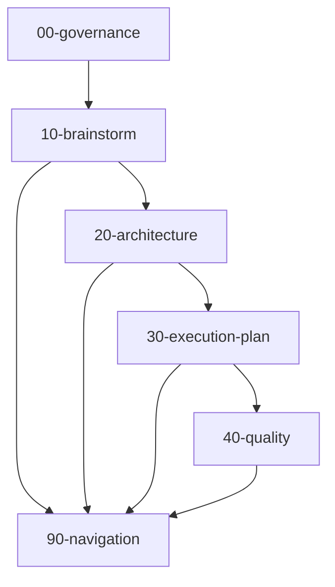

# Unified Personal Agent Platform Docs Hub

이 디렉토리는 개인 에이전트 플랫폼 관련 브레인스토밍, 아키텍처, 실행계획 문서를 단일 루트에서 관리한다.

## Directory Layout
- `00-governance`: 문서 운영 규칙, 네이밍 규칙, 변경 정책
- `10-brainstorm`: 공통/크로스컷 브레인스토밍 문서
- `20-architecture`: 공통/크로스컷 아키텍처 문서
- `20-repos`: 레포 단위 문서 버킷
- `30-domains`: 레포 독립 크로스컷 도메인 버킷
- `30-execution-plan`: 공통/크로스컷 실행 계획
- `40-quality`: 공통/크로스컷 품질 추적 문서
- `90-navigation`: 문서 맵, 읽기 순서, 참조 그래프

## Naming Convention
- 파일 패턴: `YYYY-MM-DD-uap-<subject>.<postfix>.md`
- `<postfix>`: `brainstorm`, `simulation`, `strategy`, `architecture`, `execution-plan`, `quality`, `navigation`, `meta`
- 디렉토리 prefix(`00`, `10`, `20`...)는 읽기 우선순위와 안정성 순서를 의미한다.

## Recommended Reading Flow
0. [Agent Start Guide](AGENT-START.md)
1. [Core Brainstorm](20-repos/monday/10-discovery/2026-02-27-uap-core.brainstorm.md)
2. [PlanningOps Sync Brainstorm](10-brainstorm/2026-02-27-uap-github-planningops-sync.brainstorm.md)
3. [Failure Simulation](20-repos/monday/10-discovery/2026-02-27-uap-failure-simulation.simulation.md)
4. [Contract-First Requirements](20-repos/monday/20-architecture/2026-02-27-uap-contract-first-requirements.architecture.md)
5. [Contract Boundaries](20-architecture/2026-02-27-uap-contract-boundaries.architecture.md)
6. [Foundation Execution Plan](20-repos/monday/30-execution-plan/2026-02-27-uap-contract-first-foundation.execution-plan.md)
7. [GitHub PlanningOps Sync Plan](30-execution-plan/2026-02-27-uap-github-planningops-sync.execution-plan.md)
8. [Lifecycle Scenario Playbook](30-execution-plan/2026-02-27-uap-planningops-lifecycle-scenarios.execution-plan.md)
9. [Doc Structure Migration Plan](30-execution-plan/2026-02-27-uap-doc-structure-migration.execution-plan.md)
10. [Trade-off Decision Framework](40-quality/2026-02-27-uap-planningops-tradeoff-decision-framework.quality.md)
11. [Issue Closure Matrix](20-repos/monday/40-quality/2026-02-27-uap-issue-closure-matrix.quality.md)
12. [Document Map](90-navigation/2026-02-27-uap-document-map.navigation.md)
13. [Frontmatter Catalog](2026-02-27-uap-frontmatter-catalog.navigation.md)

## New Agent Fast Path
- 1페이지 시작점: [AGENT-START](AGENT-START.md)
- 근본 원칙/행동 규약: [AGENT Principles](AGENT.md)

## Project Identity
- Canonical identity source: [M.O.N.D.A.Y. Identity](00-governance/2026-02-27-uap-monday-identity.meta.md)
- GitHub coordinate: `rather-not-work-on/monday`
- Agent-specific naming: `monday*`
- Shared platform naming: `platform-*`

## Gate Namespace Guide
- `Gate A~G`: Foundation 게이트 (`20-repos/monday/30-execution-plan/2026-02-27-uap-contract-first-foundation.execution-plan.md` 기준)
- `Sync Gate A~F`: PlanningOps Sync 게이트 (`30-execution-plan/2026-02-27-uap-github-planningops-sync.execution-plan.md` 기준)
- 품질 매트릭스의 기본 게이트 참조는 Foundation(`Gate A~G`)를 기준으로 해석한다.

## Cross-Directory Reference Policy
- `10-brainstorm` -> `20-architecture`, `30-execution-plan` 참조 허용
- `20-architecture` -> `10-brainstorm`, `40-quality` 참조 허용
- `30-execution-plan` -> `20-architecture`, `40-quality` 참조 허용
- `40-quality` -> 전체 참조 허용(추적 허브)
- `90-navigation` -> 전체 참조 허용(색인 허브)

## Frontmatter Quick Lookup
- 전체 문서 메타 확인:
  - `rg -n "^(doc_id|title|doc_type|domain|status|summary):" . -g "*.md"`
- 특정 도메인 문서 찾기(예: architecture):
  - `rg -n "^domain: architecture$|^doc_id:|^title:" . -g "*.md"`
- 상태별 문서 찾기(예: active):
  - `rg -n "^status: active$|^doc_id:|^title:" . -g "*.md"`

## Docs Automation
- 검증:
  - `bash ./00-governance/scripts/uap-docs.sh check`
- 카탈로그 생성:
  - `bash ./00-governance/scripts/uap-docs.sh catalog`
- 전체 동기화(카탈로그 갱신 + 검증):
  - `bash ./00-governance/scripts/uap-docs.sh sync`

## Reference Graph

## Migration Note
- 기존 `docs/brainstorms/*`, `docs/plans/*` 문서는 이 루트로 이동되었다.
- 새 문서는 반드시 이 루트 하위에 생성한다.
