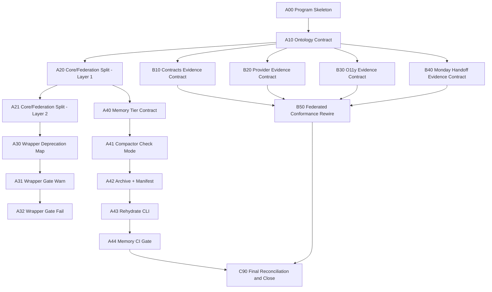

# plan: Meta Backlog Atomic Decomposition and Federated Delivery

## Context
Found brainstorm context and used it as source input:
- `2026-03-05-long-run-autonomous-quality-execution-brainstorm.md`
- `2026-03-02-uap-post-waveb-next-phase-brainstorm.md`

This meta plan converts strategy into issue-level execution units.
Goal: an operator should be able to run the program by reading issue cards only.

## Operating Model Lock
1. `platform-planningops` = SoT + control tower + policy gate.
2. Execution/runtime implementation belongs to target repos (`monday`, `platform-*`).
3. Work management is Kanban pull with hard gates, not sprint batch.
4. Every issue must be evidence-first and contract-linked.

## Atomic Issue Contract (Definition of Ready)
Every issue to be registered must include:
1. `Planning Context` metadata keys:
- `plan_item_id`
- `target_repo`
- `component`
- `workflow_state`
- `loop_profile`
- `execution_order`
- `depends_on`
2. Required sections:
- `Problem Statement`
- `Interfaces & Dependencies`
- `Evidence`
- `Acceptance Criteria`
- `Definition of Done`
3. One issue = one dominant output artifact.
4. Max scope guideline: one issue should close with `<=2` PRs in one repo.

## Program Topology
## Track A: Control-Plane Hardening (planningops)
- objective: split core/federation, formalize wrapper lifecycle, add 3-tier memory compaction.

## Track B: Federated Runtime Ownership (execution repos)
- objective: move runtime evidence contracts to owning repos and reconnect through planningops gates.

## Dependency Graph (High Level)


## Issue Pack (Atomic Units)
## A. planningops Track
| Key | Repo | Lane | Output Artifact | Depends On | Hard Gate |
|---|---|---|---|---|---|
| A00 | platform-planningops | M0 Bootstrap | `program-manifest.json` | - | issue quality + docs check |
| A10 | platform-planningops | M0 Bootstrap | `control-tower-ontology-contract.md` | A00 | contract lint pass |
| A11 | platform-planningops | M0 Bootstrap | `ontology-entity-map.json` | A10 | schema validation pass |
| A20 | platform-planningops | M1 Contract Freeze | `scripts/core/loop/selection.py` + `checkpoint_lock.py` | A10 | loop tests green |
| A21 | platform-planningops | M1 Contract Freeze | `scripts/core/loop/runner.py` + `scripts/federation/adapter_registry.py` | A20 | adapter boundary tests green |
| A22 | platform-planningops | M1 Contract Freeze | `issue_loop_runner.py` wrapper mode | A21 | compatibility tests green |
| A30 | platform-planningops | M2 Sync Core | `wrapper-deprecation-map.json` | A22 | validator test green |
| A31 | platform-planningops | M2 Sync Core | `validate_wrapper_deprecation.py` warn-mode | A30 | CI warn signal present |
| A32 | platform-planningops | M2 Sync Core | wrapper fail-mode gate in CI | A31 | no new wrapper refs |
| A40 | platform-planningops | M1 Contract Freeze | `memory-tier-contract.md` + `memory-tier-rules.json` | A10 | contract test green |
| A41 | platform-planningops | M2 Sync Core | `memory_compactor.py --mode check` | A40 | stale L0 detection pass |
| A42 | platform-planningops | M2 Sync Core | `memory_archive.py` + archive manifest schema | A41 | archive schema tests |
| A43 | platform-planningops | M2 Sync Core | `memory_rehydrate.py` | A42 | rehydrate roundtrip test |
| A44 | platform-planningops | M3 Guardrails | memory gates in federated CI | A43 | CI strict pass |

## B. Federated Repo Track
| Key | Repo | Lane | Output Artifact | Depends On | Hard Gate |
|---|---|---|---|---|---|
| B10 | platform-contracts | M1 Contract Freeze | `contract-bundle-evidence.schema.json` | A10 | local contract CI pass |
| B11 | platform-contracts | M2 Sync Core | `publish-and-pin-runbook.md` | B10 | conformance parse pass |
| B20 | platform-provider-gateway | M1 Contract Freeze | `provider-smoke-evidence.schema.json` | A10 | launcher dry-run pass |
| B21 | platform-provider-gateway | M2 Sync Core | `provider-reason-taxonomy-map.json` | B20 | taxonomy check pass |
| B30 | platform-observability-gateway | M1 Contract Freeze | `o11y-replay-evidence.schema.json` | A10 | replay dry-run pass |
| B31 | platform-observability-gateway | M2 Sync Core | `delay-replay-reason-taxonomy-map.json` | B30 | taxonomy check pass |
| B40 | monday | M1 Contract Freeze | `handoff-scheduler-evidence.schema.json` | A10 | handoff validation pass |
| B41 | monday | M2 Sync Core | `runtime-integration-runbook.md` | B40 | scheduler replay pass |
| B50 | platform-planningops | M3 Guardrails | updated federated conformance adapters | B11,B21,B31,B41 | conformance matrix pass |

## C. Reconciliation Track
| Key | Repo | Lane | Output Artifact | Depends On | Hard Gate |
|---|---|---|---|---|---|
| C90 | platform-planningops | M3 Guardrails | `federated-reconciliation-report-YYYYMMDD.md` | A44,B50 | all required checks green |

## Existing Issue Mapping (Immediate)
- `platform-planningops#92` -> umbrella tracker (`A00`, `B50`, `C90`).
- `platform-contracts#1` -> split into `B10`, `B11` sub-issues.
- `platform-provider-gateway#1` -> split into `B20`, `B21` sub-issues.
- `platform-observability-gateway#1` -> split into `B30`, `B31` sub-issues.
- `monday#2` -> split into `B40`, `B41` sub-issues.

## Issue Registration Order (Topological)
1. A00 -> A10 -> A11
2. A20 -> A21 -> A22
3. A30 -> A31 -> A32
4. A40 -> A41 -> A42 -> A43 -> A44
5. B10/B20/B30/B40 in parallel
6. B11/B21/B31/B41 in parallel
7. B50
8. C90

## Project Field Defaults (for fast creation)
- `initiative`: `unified-personal-agent-platform`
- `workflow_state`:
  - contract/spec issues: `ready-contract`
  - implementation issues: `ready-implementation`
  - integration reconciliation: `in-progress`
- `plan_lane`:
  - setup/spec: `M0 Bootstrap`/`M1 Contract Freeze`
  - implementation/sync: `M2 Sync Core`
  - gates/reconciliation: `M3 Guardrails`
- `component`: mapped to target repo domain (`planningops/contracts/provider-gateway/observability-gateway/runtime/orchestrator`)

## Issue Card Template (Execution-Ready)
Use this exact skeleton for all new issues:

```markdown
## Planning Context
- plan_item_id: `<KEY>`
- target_repo: `<owner/repo>`
- component: `<component>`
- workflow_state: `<state>`
- loop_profile: `<profile>`
- execution_order: `<number>`
- depends_on: `<keys/issues>`

## Problem Statement
- <single dominant problem>

## Interfaces & Dependencies
- <contracts/schemas/repos>

## Evidence
- <existing evidence refs>
- <expected output artifact path>

## Acceptance Criteria
- [ ] <functional>
- [ ] <validation>

## Definition of Done
- [ ] Gate command(s) pass
- [ ] Project fields synced with evidence
```

## Hard Gates by Stage
1. Spec Gate:
- issue quality contract pass
- contract/schema tests pass

2. Integration Gate:
- cross-repo conformance pass
- no wrapper-policy violations

3. Memory Gate:
- stale L0 unresolved count = 0
- archive manifest integrity pass

## Risks and Countermeasures
1. Risk: issue fragmentation overhead.
- Countermeasure: strict `one dominant artifact` rule and `<=2 PR` scope.

2. Risk: deprecation gate blocks ongoing work too early.
- Countermeasure: warn-mode minimum 14 days before fail-mode.

3. Risk: memory compaction hides needed context.
- Countermeasure: mandatory distill summary + rehydrate command before archive.

## Success Metrics
- `atomic_issue_closure_rate >= 85%` (without reopen)
- `cross_repo_blocked_wait_p95 < 72h`
- `wrapper_new_reference_count = 0` after fail-mode
- `l0_stale_uncompacted = 0`
- `federated_ci_required_checks_pass_rate >= 95%`

## Immediate Next Actions
1. Create issue set `A00~A44`, `B10~B50`, `C90` as linked cards.
2. Convert current cross-repo seed issues into sub-issues per this pack.
3. Start execution from `A00` in Kanban pull mode.
